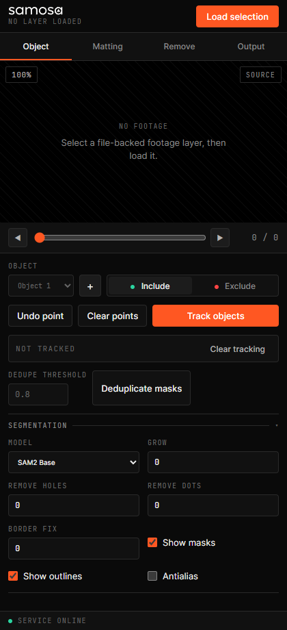

# Samosa

[](https://github.com/tenetmotion/Samosa/actions/workflows/ci.yml)
[](LICENSE)
[](docs/INSTALL.md)

Samosa is an open-source, dockable rotoscoping panel for Adobe After Effects. It connects After Effects to a separately installed [Sammie-Roto-2](https://github.com/Zarxrax/Sammie-Roto-2) runtime so object selection, tracking, matting, removal, export, and import stay inside the After Effects workflow.

Samosa is an independent integration project. It is not an official Sammie-Roto-2 project and is not affiliated with or endorsed by Adobe.



**Documentation:** [Complete installation](docs/INSTALL.md) | [Model installation](docs/MODELS.md) | [After Effects tutorial](docs/AFTER_EFFECTS_TUTORIAL.md) | [Development](docs/DEVELOPMENT.md) | [Third-party licenses](THIRD_PARTY_NOTICES.md)

## Status

The current release targets Windows and After Effects 2021 or newer through CEP. macOS is not supported in v1.0.0 and is planned after the Windows launch. The selector is embedded in the docked panel. A future native Custom Comp UI module can route clicks from the Composition viewer to the same local service API.

## Features

- Multiple objects with include and exclude point prompts
- SAM2 selection and clip-wide object tracking
- MatAnyone, MatAnyone2, and VideoMaMa matting adapters
- MiniMax and OpenCV removal adapters
- Mask cleanup, growth, antialiasing, and duplicate-frame controls
- PNG, EXR, and video output with automatic import into the active composition
- Background jobs with progress, cancellation, and tracked-frame state
- 100%, 75%, and 50% viewer scaling

## Requirements

- Windows 10 or 11
- Adobe After Effects 2021 or newer
- A working local Sammie-Roto-2 checkout and its Python environment
- A GPU/runtime supported by the selected Sammie-Roto-2 installation

Samosa does not bundle Sammie-Roto-2, model weights, Python, FFmpeg, or Adobe SDK files.

## Install

Download `Samosa-Setup-1.1.0.exe` from the [latest release](https://github.com/tenetmotion/Samosa/releases/latest) and run it. The per-user installer downloads a pinned Sammie-Roto-2 runtime, creates its isolated Python environment, installs the CEP panel, and configures After Effects under one Samosa installation root.

Choose one model mode:

- **Standard:** installs SAM2 Base now; missing models download when first requested.
- **Complete:** pre-downloads every supported model after the restricted-model license notice is accepted.
- **Custom:** selects individual model packs to pre-download.

Restart After Effects and open **Window > Extensions (Legacy) > Samosa**.

For installer modes, source-based setup, updating, uninstalling, and troubleshooting, follow the [complete installation guide](docs/INSTALL.md). See [Model installation](docs/MODELS.md) for exactly what happens when Standard mode encounters a missing model.

## Quick tutorial

1. Open a composition and select exactly one file-backed footage layer.
2. Open **Window > Extensions (Legacy) > Samosa**, then choose **Load selection**.
3. Click the viewer to add Include points; right-click or switch to Exclude to remove areas. Add another object when needed.
4. Choose **Track objects**. Add correction points on problem frames and track again.
5. Use **Matting** for refined alpha edges or **Remove** to fill the selected area.
6. Under **Output**, choose the output description, object, format, and destination, then select **Export and add to comp**.

Exports use readable names such as `interview_Hero_Person_matting_matte`. See the [After Effects tutorial](docs/AFTER_EFFECTS_TUTORIAL.md) for the complete workflow.

## Development

Run the source-only contract suite with any Python 3.10+ interpreter:

```powershell
python -m unittest discover -s tests -v
```

Set `SAMMIE_REPO` and run with the upstream virtual environment to include the deterministic integration suite:

```powershell
$env:SAMMIE_REPO = "D:\path\to\Sammie-Roto-2"
& "$env:SAMMIE_REPO\.venv\Scripts\python.exe" -m unittest discover -s tests -v
```

See [Development](docs/DEVELOPMENT.md), [Architecture](docs/ARCHITECTURE.md), and [Releasing](docs/RELEASING.md).

## Licensing and model restrictions

Samosa source code is licensed under GPL-3.0. It directly integrates with the GPL-3.0 Sammie-Roto-2 runtime, so GPL-3.0 is the conservative and compatible release choice.

Some optional engines exposed through Sammie-Roto-2 have separate noncommercial terms. In particular, MatAnyone uses the S-Lab noncommercial license, while MiniMax Remover and VideoMaMa use CC BY-NC 4.0. Installing or downloading those components does not grant commercial-use rights. Review [Third-Party Notices](THIRD_PARTY_NOTICES.md) before distributing Samosa or using those engines commercially.

## Upstream relationship

Samosa is maintained as a separate repository because it is an After Effects integration and does not modify Sammie-Roto-2 core. Fork Sammie-Roto-2 only if a contribution requires maintaining upstream core patches; submit generally useful changes upstream when possible. See [Notice](NOTICE.md) for the exact provenance used during development.

## Acknowledgements and connected projects

Samosa exists because of the work in [Sammie-Roto-2](https://github.com/Zarxrax/Sammie-Roto-2) by Zarxrax and contributors. The workflows it exposes connect to [SAM 2](https://github.com/facebookresearch/sam2), [EfficientTAM](https://github.com/yformer/EfficientTAM), [MatAnyone](https://github.com/pq-yang/MatAnyone), [MatAnyone2](https://github.com/pq-yang/MatAnyone2), [VideoMaMa](https://github.com/cvlab-kaist/VideoMaMa), and [MiniMax Remover](https://github.com/zibojia/MiniMax-Remover). Attribution here does not replace each project's license or model terms; see [Third-party notices](THIRD_PARTY_NOTICES.md).

## Contributing

Contributions are welcome under GPL-3.0. Read [Contributing](CONTRIBUTING.md), [Security](SECURITY.md), and the [Code of Conduct](CODE_OF_CONDUCT.md) before opening a change.
